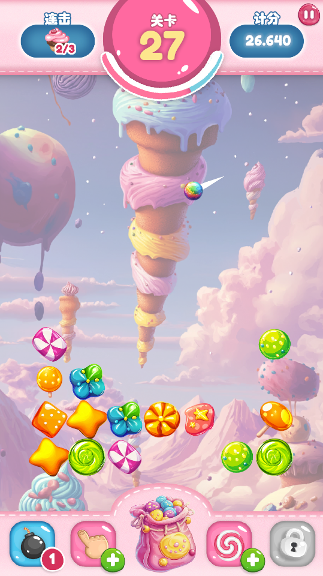

【一、游戏概述】

1. 游戏名称  《糖果派队》

2. 游戏类型  休闲动作／物理解谜类游戏

3. 目标平台  移动端（iOS/Android） & PC（鼠标控制）  （后续也可考虑其他平台，如平板、触屏设备）

4. 游戏定位与受众  定位为轻松上手但具有策略性与反应时挑战的休闲游戏，适合所有年龄层玩家，同时满足喜欢物理互动与数值调控的玩家需求。

5. 游戏背景故事  玩家置身于一个五彩斑斓的糖果世界，在这片梦幻的区域中，糖果不断地从底部涌出并上移，玩家需要通过精准发射小球打击糖果，防止糖果堆积满屏。
   （注：背景故事可以简化，重点在于玩法体验与策略考量）

6. 游戏截图

  
  
  
  

──────────────────────────────

【二、核心玩法与机制】

1. 游戏核心玩法  a. 发射小球打击糖果  
   玩家操控位于屏幕上方的发射器，通过鼠标拖拽或触屏控制瞄准和调整发射力度，发射出小球。小球在运动过程中会与场上分布的糖果发生碰撞，并将其"
   打击"。

b. 糖果群体物理响应  糖果以不规则的 Sprite 形式出现在画面中。每轮小球运动结束后，所有现有糖果会整体向上移动一个格，同时在红色标示的刷新区域（画面最下方）生成新糖果，保证终局时场上糖果数量稳定。

c. 不同糖果类型及特性  游戏场地被划分为7×10的格子矩阵，游戏内提供三种不同大小的糖果：  •
小型糖果：占据1×1格子，命中即可消除；  • 中型糖果：占据2×2格子，需要多次触击，可能带有附加特效（如局部爆炸、奖励掉落）；  •
巨无霸糖果：占据3×3格子，耐久度高，消除时可能引起连锁反应或大范围爆炸。

2. 游戏目标与成败判定  目标：通过连续击打来清除屏幕内糖果、获得分数和击破连击奖励，同时避免糖果堆积至屏幕上方；  
   判定：如果糖果移动后过多累积到屏幕上方（或超出设定区域），则判定游戏结束。

3. 关卡与难度进程  游戏以关卡制为核心，每一关根据预设的难度因子调整：  • 基础糖果数量逐关提升；  •
   不同尺寸糖果的出现几率逐步引入中型及巨无霸糖果；  • 最终关卡可能触发特殊事件（例如"糖果风暴"或"限时爆破"）。

──────────────────────────────

【三、交互与操作】

1. 控制方式  a. PC端：  利用鼠标点击并拖拽，确定发射角度和力度；释放后小球按预设物理路径运动。  b. 移动端：  
   利用手指触摸与滑动，同样实现瞄准与力度调控，界面响应采用视觉辅助（如发射器角度指示、预览弹道等）。

2. 画面反馈  a. 小球与糖果碰撞时，会有粒子、闪光、震动等特效增强反馈；  b. 糖果被打中时，根据尺寸与命中次数显示"破碎"动画；  
   c. 发射时配合弹射动感音效，增强游戏代入感。

3. UI交互  a. 主界面：首页提供开始游戏、排行榜、设置等入口；  b.
   游戏中：屏幕上方显示当前关卡、得分、剩余可操作机会（如发射次数或限时计时）；  c. 游戏结束界面：显示结束时得分、最高纪录、重玩按钮以及分享选项。

──────────────────────────────

【四、数值体系与关卡配置】

1. 数值体系设计思路  为了让玩家体验平稳递增的挑战，本游戏将采用数据驱动设计（例如使用 ScriptableObject
   资源）管理各关卡的参数。核心参数包括：  • 基础生成糖果数量及每关增量  •
   不同尺寸糖果的出现概率（例如低关卡全为小糖果，高关卡逐步加入中型、巨无霸糖果）  • 各类糖果的视觉尺寸（Scale）和耐久度（所需命中次数）

2. 示例关卡数据方案  （以下数据可通过编辑器调整，具体数值仅供参考） 【关卡 1～5】  – 基础数量：4个，增量：每关 +0.5 个（取整）  –
   糖果类型权重：小糖果(1×1) 100%  – 占地大小：小糖果 1×1格；中型 2×2格（预设，不出现）；巨无霸 3×3格（预设，不出现）  – 耐久度：小糖果
   1击  【关卡 6～10】  – 基础数量：5个，增量：+0.7  – 糖果类型权重：小糖果 80%，中型 20%  – 占地大小：小糖果 1×1格；中型 2×2格；巨无霸
   3×3格（预设）  – 耐久度：小糖果 1击，中型 2击  【关卡 11～15】  – 基础数量：6个，增量：+0.8  – 糖果类型权重：小糖果 70%，中型
   25%，巨无霸 5%  – 占地大小：小糖果 1×1格；中型 2×2格；巨无霸 3×3格  – 耐久度：小糖果 1击，中型 2击，巨无霸 4击  【关卡
   16及以上】  – 基础数量：7个，增量：+1.0  – 糖果类型权重：小糖果 60%，中型 30%，巨无霸 10%  – 占地大小：小糖果 1×1格；中型
   2×2格；巨无霸 3×3格  – 耐久度：小糖果 1击，中型 3击，巨无霸 5击  （具体数值及概率可通过 ScriptableObject 配置，详见开发模块）

3. 动态调整  在每轮小球发射结束后，游戏系统会：  – 根据当前关卡获取对应的配置数据，计算本关卡需生成的糖果总数  –
   利用预先设定的候选区域（红色刷新区）进行新糖果的生成  –
   避免新生成的糖果重叠（通过预设生成点、碰撞检测或空间分区策略实现）  这既增强了游戏的策略性，又让数值调控具备良好的扩展性和易调整性。

──────────────────────────────

【五、关卡流程与游戏节奏】

1. 游戏流程  a. 开始界面：玩家点击"开始游戏"后进入关卡选择/加载界面。  b. 关卡加载：系统根据当前关卡数，从 ScriptableObject
   中提取该关卡参数，并生成初始糖果分布（位置可随机或通过预设网格，以避免重叠）。  c. 发射阶段：  –
   玩家瞄准并发射小球，游戏会根据玩家瞄准的方向和力度，计算小球的运动轨迹，并绘制小球的运动轨迹； –
   小球在物理轨迹上运动，与糖果发生碰撞；  – 糖果根据被击情况消除或反馈（显示破碎动画、掉落奖励、产生连锁反应等）。  d.
   移动刷新阶段：  – 小球停止后，系统触发所有糖果整体向上移动一段距离；  –
   底部红色区域内自动生成新糖果弥补空缺，同时利用碰撞检测确保新糖果之间无重叠；  e. 检查判定：  –
   若糖果上移后触碰到预定的上界，则判定游戏失败；  – 否则进入下一轮发射操作，直至玩家完成本关目标或时间/机会耗尽。

2. 节奏与挑战  
   通过逐步增加糖果数量和引入高耐久度糖果，让玩家在初期能轻松上手、逐渐熟悉发射与碰撞机制，而随着关卡提升，反应时与策略预判要求提升。同时，特殊糖果（如具爆炸或连锁效果的中型、巨无霸糖果）将成为玩家解题的关键节点，鼓励玩家采用不同的发射策略。

──────────────────────────────

【六、视觉美术与音效设计】

1. 美术风格  a. 整体风格走"甜蜜梦幻"路线，采用亮丽、高饱和度的色调，糖果与背景图案均充满童趣；  b.
   糖果资源由于形态各异、颜色丰富，应设计独特的边框和渐变效果，以便玩家在混战时容易辨识不同类型糖果；  c.
   背景图和动画效果应与整体主题匹配，例如发射器、刷新区（红色区域）等都需配上细腻的光影效果。

2. 音效与配乐  a. 配乐选择轻松欢快的节奏，与糖果的甜美氛围相匹配；  b.
   各类交互动作（发射、碰撞、破碎、关卡切换等）均配有独特音效，增强玩家反馈；  c. 当糖果接近上界触发"危机预警"
   时，可播放短暂紧张的音效或背景音，提醒玩家注意节奏。

──────────────────────────────

【七、用户界面（UI/UX）设计】

1. 主界面  简洁直观，主要包括：  – 游戏标题、背景动画；  – 开始游戏按钮、排行榜、设置及帮助入口；  –
   显示最新活动或公告的区域（如有后续活动、新模式扩展时）。

2. 游戏内界面  a. 左上角：关卡显示、目标提示（例如：本关需消除糖果数量、特别对象任务）；  b.
   右上角：当前得分、连击数、剩余发射次数或倒计时显示；  c. 底部：操作区展示当前发射器动态和瞄准辅助（如弹道预览）；  d.
   界面设计上确保不会遮挡游戏场景，同时采用半透明设计以便玩家观察游戏细节。

3. 结算界面  显示：  – 本关得分、最高得分、历史记录；  – "重玩"、"返回主菜单"、"分享成绩"等选项按钮；  –
   适当的奖励展示及特殊提示（例如连击奖励、特殊糖果奖励）。

──────────────────────────────

【八、扩展玩法与后续发展】

1. 奖励与道具系统  a. 发射道具：例如"多球模式"、"放大镜（看透糖果弱点）"；  b. 糖果特殊能力：部分糖果在被击中后可能掉落短暂增益效果（如得分翻倍、防护护盾等）。

2. 每日挑战／活动关  定期推出限定关卡或活动模式，打破常规数值设定，引入独特场景与规则（例如"糖果暴走模式"）。

3. 社交及排行榜  实现在线排行榜、好友PK对战、成就系统等，增加玩家粘性与社群互动。

